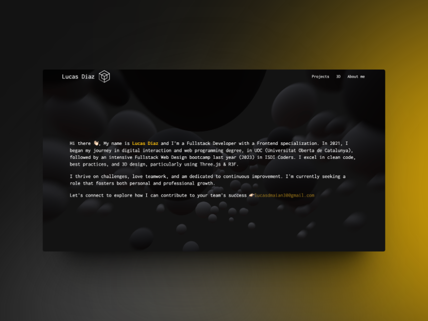

# PORTFOLIO OF LUCAS DAMIAN DIAZ CUENCA 🧑🏼‍💻

## Details ✨

This is my main **repository** where I create my portfolio showcasing all my projects 🛠️, abilities 💪🏻 & some information about myself 👋🏻.

## Development Guidelines

-   For adding new features: `feature/short-naming-of-new-feature`
-   For adding or modifying tests: `test/name-features-to-test`
-   For bug fixes: `bugfix/short-description-of-bug`
-   For refactoring without adding new features or fixing bugs: `refactor/short-description`
-   To quickly fix a critical issue in production: `hotfix/short-description`

## URL 💻

Here is the **url** just in case you want to visit my portfolio:

https://www.lucasdiaz.xyz/
